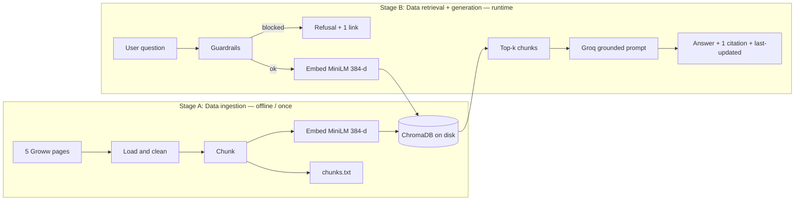
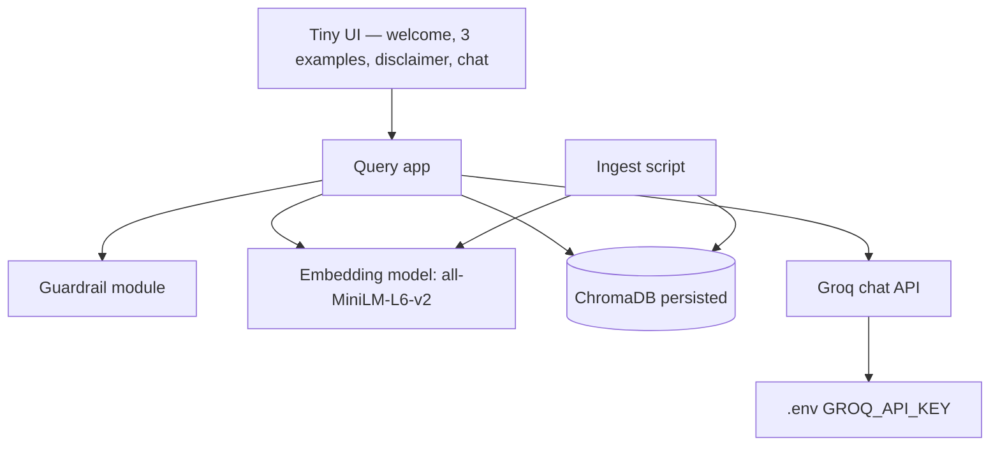
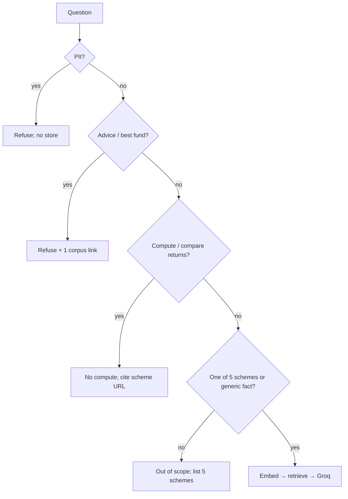

# Architecture

**Product:** HDFC Mutual Fund FAQ RAG Chatbot  
**Based on:** `docs/PRD.md`  
**Constraint:** Ingestion and query are separate stages. The demo must walk both.

---

## 1. Purpose

A facts-only FAQ assistant over **five Groww HDFC Direct–Growth scheme pages**. Answers come only from retrieved chunks. Every answer includes **one citation URL**. The Groq LLM must not invent numbers or give advice.

---

## 2. High-level view

Two pipelines share one embedding model and one persisted vector store. They do **not** share a process: ingest runs once (or on demand); the app only reads ChromaDB at query time.



| Stage | PRD name | When it runs | Output |
|-------|----------|--------------|--------|
| A | Data ingestion | Manual script, once per corpus refresh | Chroma persist dir + `data/chunks.txt` + ingest timestamp |
| B | Data retrieval | Every user question in the UI | ≤3-sentence answer, one URL, last-updated line |

---

## 3. System components



| Component | Role | PRD mapping |
|-----------|------|-------------|
| Ingest script | Load → chunk → embed → store; write inspectable chunks | FR-1, FR-2, FR-3 |
| ChromaDB (disk) | Vector index of chunks + metadata | FR-1; ingest not on app start |
| MiniLM embedder | Same 384-d vectors for documents and questions | FR-3 |
| Guardrails | Advice, PII, out-of-scope, performance-compute | FR-7, FR-9, FR-10 |
| Groq generator | Grounded answer from retrieved text only | FR-4, FR-5, FR-8, FR-11 |
| Tiny UI | Welcome, 3 examples, “Facts-only. No investment advice.” | PRD §5 |
| `.env` | Groq key; never committed | FR-11 |

**Suggested runtime (PRD default):** Python. Streamlit or Gradio for UI. One ingest CLI + one query app.

---

## 4. Stage A — Data ingestion

**Does not run on UI start.** Restarting the chatbot only opens the existing Chroma path.

```
Load pages → Clean text → Chunk → Embed → Store in Vector DB
                 ↘ write data/chunks.txt
```

### 4.1 Load

- Fetch the **five URLs only** (PRD §4.1).
- Extract visible text (strip nav/chrome where practical).
- Record `fetched_at` for `Last updated from sources:`.

### 4.2 Clean

- Normalize whitespace.
- Keep scheme facts: expense ratio, exit load, min SIP, lock-in, riskometer, benchmark, statement-download text if present.
- Drop unrelated site chrome when possible so embeddings are not noise-heavy.

### 4.3 Chunk (lock after inspecting pages)

PRD requires inspecting page text **before** coding chunk parameters. Until inspection, use this starting proposal:

| Parameter | Starting value | Why |
|-----------|----------------|-----|
| Split style | Heading / fact-block first; else character windows | Groww pages are compact fact blocks; keep expense ratio and scheme name together |
| Size | ~400–600 characters | Short pages; avoid tiny fragments |
| Overlap | 10–15% | Do not split a number from its label |
| Metadata | `source_url`, `scheme_name`, `category`, optional `section` | Citation (FR-6) and scheme filter |

Categories: `large-cap` | `flexi-cap` | `elss` | `small-cap` | `hybrid`.

Write the locked strategy to `docs/chunking.md` (or README) after inspection.

### 4.4 Embed

- Model: `sentence-transformers/all-MiniLM-L6-v2`
- Local, no API key, **384 dimensions**
- Embed each chunk once at ingest time

### 4.5 Store

- ChromaDB collection (e.g. `hdfc_mf_faq`)
- Persist directory on disk (e.g. `data/chroma/`)
- Document = chunk text; metadata = §4.3 fields
- Also dump **all** chunks to `data/chunks.txt` for instructor inspection (FR-2)

### 4.6 Ingest artifacts

```
data/
  sources.md          # five URLs (deliverable)
  raw/                # optional saved HTML/text per scheme
  chunks.txt          # human-readable chunks
  chroma/             # persisted vector DB
  ingest_meta.json    # fetched_at / last-updated date
```

---

## 5. Stage B — Data retrieval and generation

```
Question → Embed → Retrieve top chunks → LLM → Answer
```

Guardrails run **before** embed/retrieve when the intent is clearly blocked (advice, PII). Retrieval still runs for in-scope factual questions.

### 5.1 Request path

1. User submits a question in the tiny UI.
2. **Guardrails**
   - PII (PAN, Aadhaar, account numbers, OTP, email, phone): refuse; do not log identifiers; ask to rephrase.
   - Advice / buy-sell / “best fund” / portfolio: refuse; polite facts-only message + **one** relevant scheme or educational link from the corpus.
   - Returns compute/compare: do not calculate; point at the scheme’s source URL.
   - Scheme not in the five: out of scope; list the five schemes.
3. Embed the question with **the same MiniLM model**.
4. Query ChromaDB; retrieve **top-k = 4** (tune after first tests; stay in 3–5).
5. Build a grounded prompt: only the retrieved chunk texts + metadata; instruct:
   - facts only, **≤3 sentences**
   - do not invent numbers
   - if chunks lack the fact, say the listed sources do not contain it
   - no investment advice
6. Call Groq (`GROQ_API_KEY` from `.env`).
7. Attach **exactly one** citation: `source_url` of the best-matching retrieved chunk (highest similarity among used chunks).
8. Append `Last updated from sources: <ingest date>`.
9. Render in UI with disclaimer always visible.

### 5.2 Answer contract

| Field | Rule |
|-------|------|
| Body | ≤3 sentences, grounded in chunks |
| Citation | One URL from chunk metadata (FR-6) |
| Freshness | `Last updated from sources: YYYY-MM-DD` |
| Unknown | Explicit; no fabricated ratios or loads |

Empty or weak retrieval: “I don’t have that in the listed sources.” Optionally cite the closest scheme page.

---

## 6. Grounded prompt (behavior)

The generator receives:

- System: facts-only FAQ assistant; corpus-bound; no advice; ≤3 sentences; unknown if not in context.
- User question.
- Retrieved chunks: text + `source_url` + `scheme_name`.

The app, not the model, chooses the single citation URL from retrieval metadata so the link is always a real corpus URL.

---

## 7. Guardrails placement



Guardrails are product logic in the query app. They are not a second LLM agent.

---

## 8. UI architecture

Minimal surface (PRD §5):

- Welcome line (what the bot is).
- Three example questions (PRD §5.2).
- Persistent note: **Facts-only. No investment advice.**
- Chat transcript.
- Each bot turn: answer + citation link + last-updated.
- Disclaimer snippet (PRD §5.3) in the page footer or sidebar.

No login, no PII fields, no account APIs.

---

## 9. Suggested repo layout

```
FAQ_CHATBOT/
  docs/
    problemstatement.txt
    PRD.md
    architecture.md
    chunking.md              # after page inspection
  data/
    sources.md
    chunks.txt
    chroma/
    ingest_meta.json
  src/
    ingest.py                # Stage A
    query.py                 # Stage B retrieve + generate
    guardrails.py
    embeddings.py            # shared MiniLM
    app.py                   # tiny UI
  .env                       # GROQ_API_KEY (gitignored)
  .env.example
  requirements.txt
  README.md
  samples/qa.md              # 5–10 Q&A deliverable
```

Ingest imports embeddings + writes Chroma. App imports embeddings + reads Chroma. No ingest call inside `app.py` startup.

---

## 10. Configuration

| Key | Source | Notes |
|-----|--------|--------|
| `GROQ_API_KEY` | `.env` | Never commit |
| Groq model name | README / env | Pick a current Groq chat model |
| Chroma persist path | config | Disk path shared by ingest and app |
| `TOP_K` | 4 default | PRD open decision |
| Embedding model name | constant | `sentence-transformers/all-MiniLM-L6-v2` |

---

## 11. Trust and limits (architecture implications)

- **Public HTTP only:** five Groww URLs; no app backends, no blogs.
- **No PII store:** no user DB; prompts with PII are not written to logs.
- **No performance engine:** no return math in code or prompts.
- **Stale corpus:** last-updated is ingest time, not live Groww HTML.
- **Retrieval miss:** MiniLM + small k can miss a table cell; chunking and k are the levers.
- **LLM paraphrase:** prompt + “unknown if missing” + app-owned citation reduce hallucination.

---

## 12. Demo walkthrough (maps to RAG stages)

1. Show `data/chunks.txt` and `data/chroma/` (ingestion already done).
2. Ask an in-scope fact (expense ratio / lock-in / exit load).
3. Show citation URL matching a corpus page.
4. Ask “Should I buy this fund?” → refusal.
5. Ask returns comparison or an unknown fact → no compute / honest miss.

That sequence is the architecture story: **ingest once, retrieve at ask time, generate only from chunks.**
